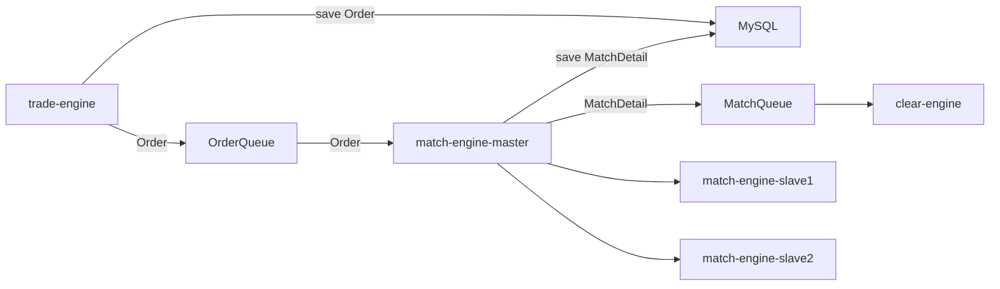
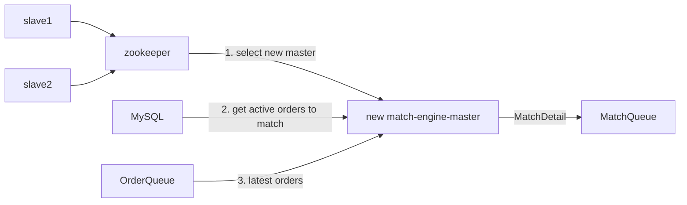

# warp 交易系统

参考https://liaoxuefeng.com/books/java/springcloud/architecture/index.html 进行设计的，不同于原项目很多的操作只在内存中进行，
本项目利用mysql对所有有用的数据均进行持久化。

**整体架构**

```mermaid
graph LR
    A[trade-engine] --> |Order| OrderQueue
    A --> |save Order| MySQL
    OrderQueue --> |Order| B[match-engine-master]
    
    B --> |MatchDetail| MatchQueue
    B --> match-engine-slave1
    B --> match-engine-slave2
    MatchQueue --> C[clear-engine]
    B --> |save MatchDetail| MySQL
    
```

**match-engine-master挂掉后切换**

```mermaid
graph LR
    slave1 --> ZK
    slave2 --> ZK
    ZK[zookeeper] --> |1. select new master| A[new match-engine-master]
    MySQL --> |2. get active orders to match| A
    OrderQueue --> |3. latest orders| A
    A --> |MatchDetail| MatchQueue
```
